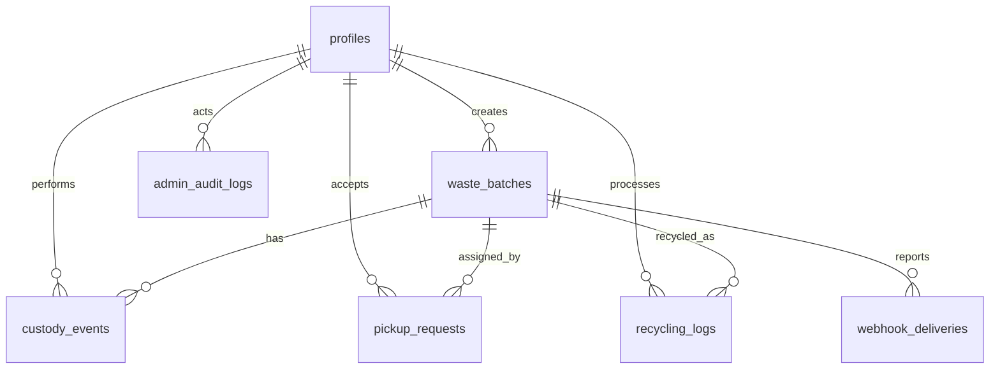

# Data Model

This document describes the current Supabase/Postgres schema for Sustainable ECG. The source of truth is the migration set in `supabase/migrations/`.

## Relationship Diagram

## profiles

Extends Supabase Auth users with operational role, company details, and approval status.

| Field | Type | Notes |
| --- | --- | --- |
| `id` | `uuid` | Primary key, references `auth.users` |
| `role` | `text` | `generator`, `collector`, `recycler`, or `admin` |
| `company_name` | `text` | Organization or user display name |
| `phone` | `text` | Contact phone |
| `gst_number` | `text` | Optional GST identifier |
| `status` | `text` | `pending`, `approved`, or `suspended` |
| `created_at` | `timestamptz` | Server timestamp |

Important behavior:

- Registering creates both a Supabase Auth user and a `profiles` row.
- Collectors and recyclers must be approved before operational use.
- Suspended users are blocked from protected actions.

## waste_batches

Stores the main waste batch record created by a generator.

| Field | Type | Notes |
| --- | --- | --- |
| `id` | `uuid` | Primary key |
| `batch_code` | `text` | Unique code such as `WM-2026-00004` |
| `generator_id` | `uuid` | References `profiles.id` |
| `waste_type` | `text` | Material group such as plastic, e-waste, metal, glass, organic |
| `category` | `text` | CPCB-style category code used by the app |
| `weight_kg` | `numeric` | Declared generator weight |
| `pickup_address` | `text` | Address snapshot for pickup |
| `pickup_date` | `date` | Requested pickup date |
| `images` | `text[]` | Supabase Storage URLs for generator evidence |
| `qr_token` | `text` | Signed server-side QR token |
| `status` | `text` | `pending`, `assigned`, `picked_up`, `in_transit`, `delivered`, `recycled` |
| `created_at` | `timestamptz` | Server timestamp |

Important behavior:

- `batch_code` is generated by `next_batch_code()`.
- QR print payload is short; complete details are fetched from this table after scan.
- Status is a fast-read projection of custody events.

## custody_events

Stores the append-only custody chain. This is the legal and audit backbone of the platform.

| Field | Type | Notes |
| --- | --- | --- |
| `id` | `uuid` | Primary key |
| `batch_id` | `uuid` | References `waste_batches.id` |
| `actor_id` | `uuid` | References `profiles.id` |
| `event_type` | `text` | `qr_generated`, `pickup_accepted`, `pickup_scanned`, `in_transit`, `delivered`, `recycled`, `rejected` |
| `location_lat` | `numeric` | GPS latitude when available |
| `location_lng` | `numeric` | GPS longitude when available |
| `photo_url` | `text` | Evidence photo URL for pickup/delivery events |
| `weight_verified_kg` | `numeric` | Verified weight at pickup, delivery, or recycling |
| `notes` | `text` | Operational notes |
| `created_at` | `timestamptz` | Server timestamp |

Important behavior:

- Events are append-only. Update and delete are blocked.
- Pickup and delivery scans require proof photos.
- Status transitions should be derived from this event history.

## pickup_requests

Stores collector acceptance and pickup assignment state.

| Field | Type | Notes |
| --- | --- | --- |
| `id` | `uuid` | Primary key |
| `batch_id` | `uuid` | References `waste_batches.id` |
| `collector_id` | `uuid` | References `profiles.id` |
| `status` | `text` | `pending`, `accepted`, `rejected`, or `completed` |
| `accepted_at` | `timestamptz` | Set when collector accepts |
| `estimated_pickup` | `timestamptz` | Optional ETA |
| `created_at` | `timestamptz` | Server timestamp |

Important behavior:

- Collector acceptance creates or updates the pickup assignment.
- Acceptance also records custody movement and updates the batch to `assigned`.

## recycling_logs

Stores recycler-submitted recycling details used for EPR reporting.

| Field | Type | Notes |
| --- | --- | --- |
| `id` | `uuid` | Primary key |
| `batch_id` | `uuid` | References `waste_batches.id` |
| `recycler_id` | `uuid` | References `profiles.id` |
| `material_type` | `text` | Material processed |
| `quantity_kg` | `numeric` | Recycled quantity |
| `recycling_method` | `text` | Method used |
| `epr_credits_claimed` | `numeric` | Credits calculated or claimed |
| `report_url` | `text` | Optional report URL |
| `created_at` | `timestamptz` | Server timestamp |

Important behavior:

- A batch must be delivered before it can be recycled.
- Recycling completion also creates a `recycled` custody event.
- Recycling may enqueue an outbound EPR webhook delivery.

## webhook_deliveries

Stores durable outbound EPR webhook attempts.

| Field | Type | Notes |
| --- | --- | --- |
| `id` | `uuid` | Primary key |
| `batch_id` | `uuid` | References `waste_batches.id` |
| `delivery_type` | `text` | Usually EPR compliance delivery |
| `status` | `text` | Pending, processing, delivered, failed, or abandoned style states |
| `payload` | `jsonb` | Compliance payload sent to the portal |
| `idempotency_key` | `text` | Stable key to avoid duplicate external processing |
| `attempts` | `integer` | Number of delivery attempts |
| `next_attempt_at` | `timestamptz` | Retry scheduling |
| `last_error` | `text` | Most recent failure detail |
| `created_at` | `timestamptz` | Server timestamp |
| `updated_at` | `timestamptz` | Server timestamp |

Important behavior:

- Failed deliveries can be retried by cron or admin action.
- Abandoned deliveries can trigger an ops alert webhook.

## admin_audit_logs

Stores privileged admin actions.

| Field | Type | Notes |
| --- | --- | --- |
| `id` | `uuid` | Primary key |
| `actor_id` | `uuid` | Admin profile performing the action |
| `action` | `text` | Action name, such as approval or webhook retry |
| `target_type` | `text` | Entity type being changed |
| `target_id` | `uuid` | Target entity ID when available |
| `metadata` | `jsonb` | Extra structured action context |
| `created_at` | `timestamptz` | Server timestamp |

Important behavior:

- Admin approval, suspension, and manual retry actions are logged.
- Admin logs are visible from the admin dashboard.

## Status and Event Mapping

| Batch Status | Custody Event That Leads To It | Actor |
| --- | --- | --- |
| `pending` | `qr_generated` | Generator |
| `assigned` | `pickup_accepted` | Collector |
| `picked_up` | `pickup_scanned` | Collector |
| `in_transit` | `in_transit` | Collector |
| `delivered` | `delivered` | Recycler |
| `recycled` | `recycled` | Recycler |

## Row-Level Security Summary

The migrations enable RLS on the main tables.

- Generators can read their own batches.
- Collectors can read available batches and their assigned batches.
- Recyclers can read incoming in-transit/delivered work needed for recycling.
- Admins can read and manage operational records.
- Approved actors can insert valid custody events through controlled flows.
- Service role is used for server-side administrative and webhook operations.

## Realtime Tables

Supabase Realtime is enabled for:

- `waste_batches`
- `custody_events`

These tables power live dashboard status updates and audit timeline refreshes.

## Storage References

Images are stored in Supabase Storage and referenced by URL in:

- `waste_batches.images`
- `custody_events.photo_url`
- `recycling_logs.report_url`

The application uses signed upload URLs so clients can upload evidence directly without receiving server credentials.

