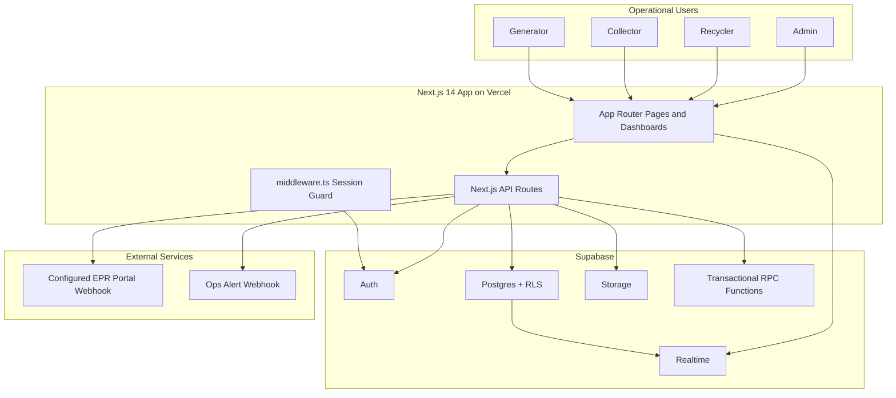
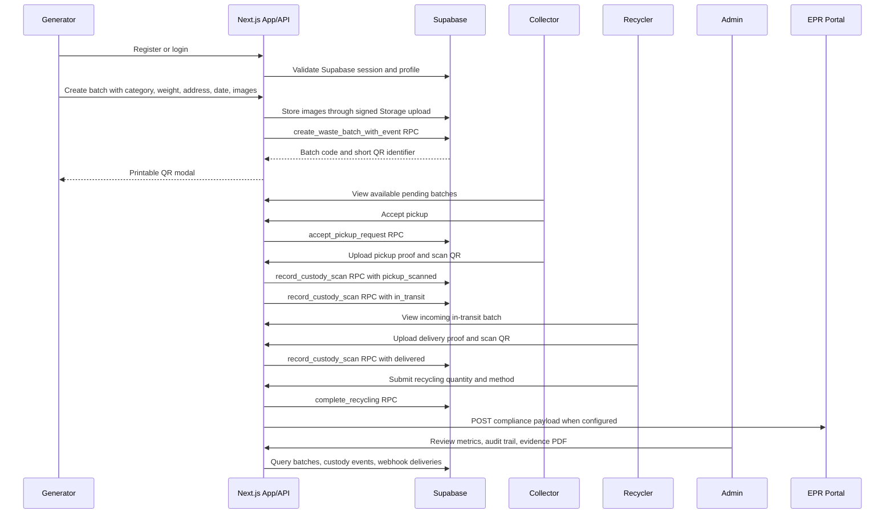
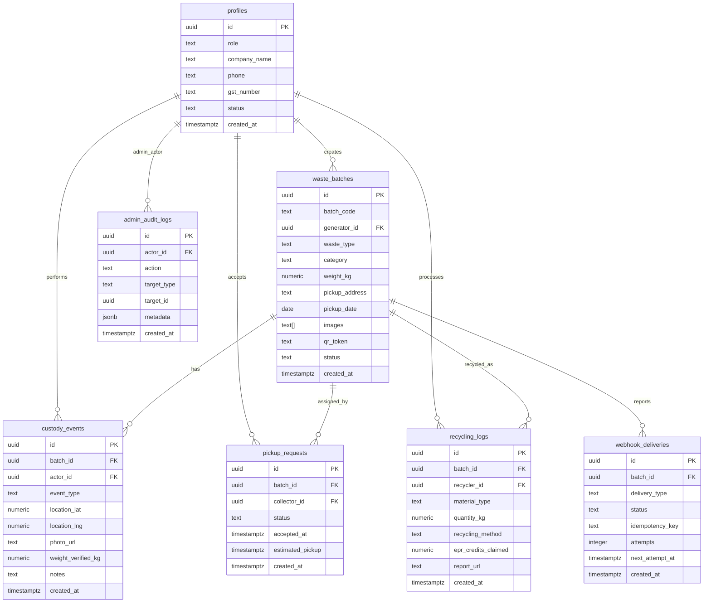
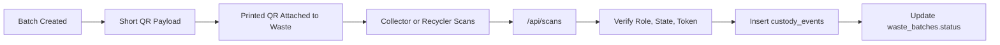
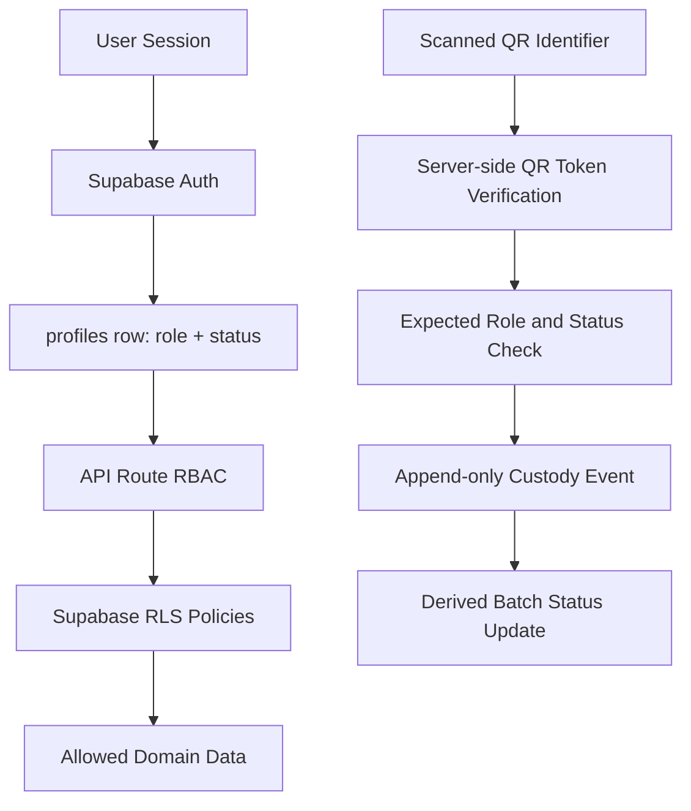
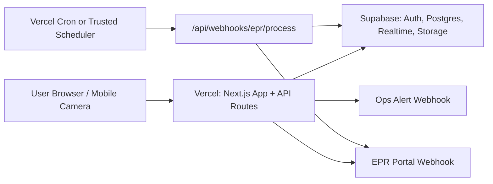

# Sustainable ECG Project Architecture

This document explains the current Sustainable ECG application architecture, the production MVP flow, the data model, and the technical stack. It reflects the system that is implemented in this repository today.

## Executive Summary

Sustainable ECG is a waste traceability and EPR compliance platform for the Indian market. It tracks waste batches from generator creation through collector pickup, recycler delivery, recycling completion, admin audit review, and EPR webhook reporting.

The legal backbone of the product is the custody chain. Every operational transition writes an append-only `custody_events` row before the visible batch status changes. The `waste_batches.status` field is used for fast dashboard display, while custody events remain the audit source of truth.

## Tech Stack

| Layer | Technology | Purpose |
| --- | --- | --- |
| Frontend | Next.js 14 App Router | Role dashboards, landing page, auth, scanner UI |
| Language | TypeScript | Type-safe frontend, API routes, domain helpers |
| Styling | Tailwind CSS, shadcn-style primitives | Responsive production UI |
| Backend | Next.js API routes | MVP API layer hosted with the frontend |
| Auth | Supabase Auth | Email/password sessions and user identity |
| Database | Supabase Postgres | Batch, custody, pickup, recycling, webhook, audit records |
| Realtime | Supabase Realtime | Live dashboard status updates where enabled |
| Storage | Supabase Storage | Generator images, pickup proof, delivery proof |
| QR Rendering | `qrcode` | Printable QR image generation |
| QR Scanning | `html5-qrcode` | Browser/device camera scanning |
| QR Integrity | `jsonwebtoken` | Signed server-side QR token verification |
| Icons | `lucide-react` | Dashboard and control icons |
| Deployment Target | Vercel | Next.js frontend and API routes |
| External Integrations | EPR webhook endpoint, ops alert webhook | Compliance reporting and operational alerts |

## System Architecture



## Runtime Components

| Component | Main Files | Responsibility |
| --- | --- | --- |
| Landing and public UI | `app/page.tsx` | Product overview, role CTAs, demo metrics |
| Auth UI | `app/auth/page.tsx` | Login/register with role selection |
| Generator dashboard | `app/dashboard/generator/page.tsx` | Create batch, upload images, display QR, list batches |
| Collector dashboard | `app/dashboard/collector/page.tsx` | Available pickups, accept jobs, scan pickup QR, mark transit |
| Recycler dashboard | `app/dashboard/recycler/page.tsx` | Delivery scan, evidence upload, recycling completion |
| Admin dashboard | `app/dashboard/admin/page.tsx` | Approvals, metrics, audit trail, batch evidence, webhook review |
| API client | `lib/api-client.ts` | Browser fetch wrapper with JSON and blob support |
| Server auth | `lib/auth/server.ts` | Session and role checks for API routes |
| QR helpers | `lib/qr.ts` | Short QR payload handling and JWT verification helpers |
| Upload helpers | `lib/uploads.ts` | Signed upload URL validation and storage paths |
| EPR webhooks | `lib/epr-webhooks.ts` | Durable webhook delivery, retry, and abandonment alerting |
| Observability | `lib/observability.ts` | Structured server logs and alert dispatching |
| Rate limit | `lib/rate-limit.ts` | In-runtime request throttling for sensitive endpoints |

## Role Dashboards

| Role | Main Capabilities |
| --- | --- |
| Generator | Register/login, create waste batch, upload generator photos, receive printable QR, monitor status live, view batch list |
| Collector | View pending pickups, accept/reject pickup, upload pickup proof, scan QR at pickup, move accepted batch to transit |
| Recycler | View in-transit waste, upload delivery proof, scan QR at delivery, mark batch as recycled, create recycling log |
| Admin | Approve/suspend users, view pipeline metrics, inspect custody events, export CSV, download evidence PDF, retry webhook deliveries |

## Golden Custody Flow



## Data Model



## QR and Scan Architecture

The QR system intentionally keeps the printed QR payload short. The QR should not contain full batch JSON, images, or custody data.

Current design:

1. Generator creates a batch.
2. API creates a stable batch code such as `WM-2026-00004`.
3. API stores a signed `qr_token` server-side for authenticity.
4. The generated QR contains only the short identifier used by the scanner flow.
5. Scanner decodes the short identifier.
6. API fetches the full batch details from Supabase.
7. API verifies expected actor role, batch state, and QR authenticity.
8. API inserts the custody event before moving the batch to the next status.



This design makes QR codes visually cleaner, easier for cameras to decode, and more reliable during uploads or low-light scanning.

## API Surface

| API Route | Role Access | Purpose |
| --- | --- | --- |
| `POST /api/auth/register` | Public | Create Supabase Auth user and profile row |
| `GET /api/auth/session` | Authenticated | Resolve current user and profile status |
| `GET /api/metrics` | Public/dashboard | Aggregate landing and dashboard metrics |
| `GET /api/batches` | Role-based | List batches visible to the current user |
| `POST /api/batches` | Generator | Create batch, QR token, and initial custody event |
| `POST /api/pickups` | Collector | Accept/reject pickup requests and assign jobs |
| `POST /api/scans` | Collector, recycler | Verify QR scan and create custody events |
| `POST /api/recycling` | Recycler | Create recycling log, update recycled status, enqueue webhook |
| `GET /api/audit` | Admin | Full custody audit trail |
| `POST /api/admin/approvals` | Admin | Approve or suspend users |
| `GET /api/admin/audit-logs` | Admin | Inspect admin actions |
| `GET /api/admin/batches/[id]/evidence.pdf` | Admin | Download compliance evidence PDF |
| `POST /api/uploads/signed-url` | Authenticated roles | Create signed Supabase Storage upload URL |
| `GET /api/webhooks/epr/deliveries` | Admin | View webhook delivery queue |
| `POST /api/webhooks/epr/process` | Cron secret or admin retry | Retry pending/failed EPR webhook deliveries |
| `GET /api/health` | Monitoring | Validate environment, Supabase, tables, and storage |

## Database Integrity and RPC Layer

The most important state transitions are implemented through Supabase/Postgres functions so that custody writes and status changes happen atomically.

| RPC / Migration Area | Purpose |
| --- | --- |
| `create_waste_batch_with_event` | Creates a batch and its first `qr_generated` custody event together |
| `accept_pickup_request` | Assigns a collector and moves a batch from pending to assigned |
| `record_custody_scan` | Records pickup, transit, or delivery event before status update |
| `complete_recycling` | Creates recycling log, records recycled event, updates status |
| `enqueue_epr_webhook_delivery` | Stores an outbound compliance delivery with idempotency |
| `claim_webhook_deliveries` | Locks due webhook records for retry processing |
| `mark_webhook_delivery_result` | Marks webhook success, failure retry, or abandoned state |

The database also includes append-only enforcement for custody events and evidence integrity constraints for required pickup and delivery proof.

## Security Model



Controls currently implemented:

- Supabase Auth owns identity.
- `profiles.role` controls dashboard access and API authorization.
- `profiles.status` blocks pending or suspended operational users.
- API routes check role before returning or mutating data.
- Supabase Row Level Security protects table access.
- Custody events are append-only.
- Scan actions verify QR signature, expected role, and expected batch status.
- Pickup and delivery scans require evidence photo URLs.
- Uploads use signed Supabase Storage URLs rather than raw service key exposure.
- Sensitive endpoints have rate-limit checks.
- Admin actions are written to `admin_audit_logs`.

## Storage and Evidence

Supabase Storage is used for:

- Generator batch images.
- Collector pickup proof photos.
- Recycler delivery proof photos.

The browser requests a signed upload URL from `POST /api/uploads/signed-url`, uploads directly to Supabase Storage, then submits the returned URL to the relevant batch, scan, or recycling API. This avoids routing large image files through the Next.js API layer.

Admin evidence tools include:

- Batch custody timeline.
- Actor, timestamp, GPS, weight, notes, and evidence photo URL review.
- CSV export.
- PDF evidence packet download.

Current PDF packets include custody details and evidence URLs. Embedding binary image thumbnails directly into the PDF is a future hardening option.

## EPR Webhook Architecture

When a recycler marks a batch as recycled, the system creates a recycling log and prepares a compliance payload:

```json
{
  "batch_code": "WM-2026-00004",
  "recycler_id": "uuid",
  "quantity_kg": 120,
  "category": "PWM-CAT-II",
  "timestamp": "2026-05-19T00:00:00.000Z",
  "custody_chain": []
}
```

Delivery behavior:

1. If `EPR_WEBHOOK_URL` is configured, enqueue a durable `webhook_deliveries` row.
2. Try immediate delivery once.
3. Allow retries through `POST /api/webhooks/epr/process`.
4. Use `WEBHOOK_CRON_SECRET` for trusted scheduler calls.
5. Mark abandoned deliveries after retry budget is exhausted.
6. Send ops alerts through `OPS_ALERT_WEBHOOK_URL` when configured.

## Deployment Topology



Required environment variables:

```text
NEXT_PUBLIC_SUPABASE_URL=
NEXT_PUBLIC_SUPABASE_ANON_KEY=
SUPABASE_SERVICE_ROLE_KEY=
JWT_SECRET=
EPR_WEBHOOK_URL=
WEBHOOK_CRON_SECRET=
OPS_ALERT_WEBHOOK_URL=
NEXT_PUBLIC_APP_URL=
```

## Smoke Tests and Production Readiness

| Script | Purpose |
| --- | --- |
| `npm run smoke:golden` | Runs the full local custody pipeline through the app APIs |
| `npm run smoke:security` | Checks wrong-role access, invalid QR, invalid status transitions, suspended users |
| `npm run smoke:health` | Checks structured `/api/health` readiness behavior |
| `npm run smoke:rate-limit` | Verifies sensitive endpoint throttling |
| `npm run smoke:production` | Runs the real Supabase/Auth/Storage/API custody flow and cleans up temporary data |

The production smoke test passing means the MVP custody pipeline is working end to end against the connected database and storage:

Generator creates batch -> QR generated -> collector accepts -> pickup scan -> transit -> recycler delivery scan -> recycled -> admin audit visible.

## Current Production Notes

- The MVP is ready for pilot/investor demo when migrations, environment variables, admin user setup, storage bucket policy, and production smoke tests are complete.
- Application-level rate limits are per warm runtime. For internet production, add platform or edge throttling through Vercel, a WAF, or API gateway rules.
- Real-device QA should be done on Android and iOS camera scanning before field launch.
- The PDF evidence packet is useful for compliance review but does not yet embed the original image binaries.
- `EPR_WEBHOOK_URL` and `OPS_ALERT_WEBHOOK_URL` can be left empty for demo environments, but should be configured for production operations.
- Post-MVP items such as AI prediction, blockchain verification, credit trading, GPS live maps, IoT, and regulator portals are intentionally outside the current build.

## File Map

| Path | What it contains |
| --- | --- |
| `app/` | Next.js App Router pages and API routes |
| `app/dashboard/` | Role-specific dashboards |
| `app/api/` | Backend API routes for auth, batches, pickups, scans, recycling, admin, uploads, webhooks, health |
| `components/` | Shared UI primitives |
| `lib/` | Domain logic, Supabase clients, auth helpers, QR, uploads, webhooks, rate limits |
| `supabase/migrations/` | Database schema, RLS, RPCs, webhook queue, admin audit, evidence constraints |
| `scripts/` | Admin setup and smoke tests |
| `docs/` | Architecture, data model, deployment readiness, screens, scope |

