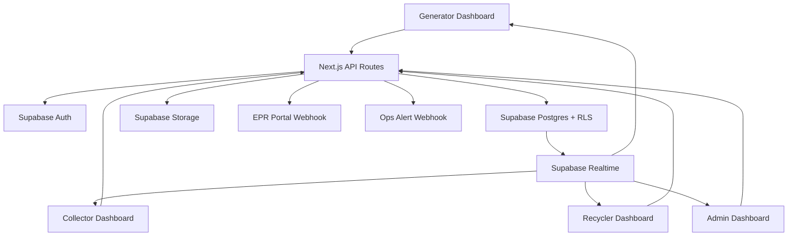
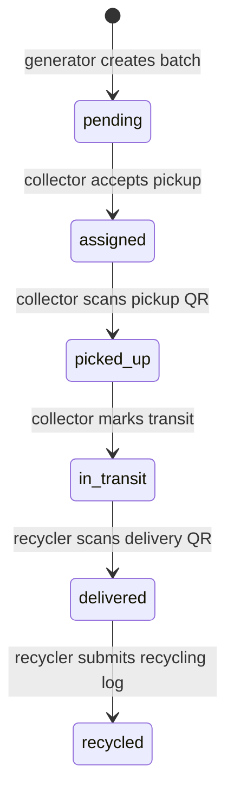
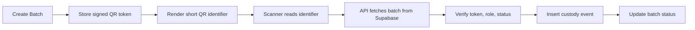

# Technical Architecture

This document describes the current Sustainable ECG production MVP architecture. For the larger illustrated overview, see `docs/project-architecture.md`.

## Architecture Goals

Sustainable ECG is built around one reliable operational pipeline:

Generator creates a waste batch -> QR is printed -> collector scans at pickup -> collector marks transit -> recycler scans delivery -> recycler marks recycled -> admin audits the complete custody chain.

The architecture is designed for:

- Legally useful custody traceability.
- Short, reliable QR codes.
- Role-based access for generators, collectors, recyclers, and admins.
- Supabase-backed persistence, auth, storage, realtime, and row-level security.
- Repeatable smoke tests for investor demos, pilots, and production checks.

## Stack

| Area | Implementation |
| --- | --- |
| Frontend | Next.js 14 App Router, React 18, TypeScript |
| Styling | Tailwind CSS and shadcn-style local UI primitives |
| Backend | Next.js API routes |
| Database | Supabase Postgres |
| Auth | Supabase Auth with a `profiles` extension table |
| Realtime | Supabase Realtime for `waste_batches` and `custody_events` |
| Storage | Supabase Storage with signed upload URLs |
| QR generation | `qrcode` npm package |
| QR scan | `html5-qrcode` browser scanner |
| QR signing | `jsonwebtoken` using `JWT_SECRET` |
| External compliance | Durable EPR webhook queue |
| Deployment | Vercel for app and API routes, Supabase for backend services |

## System Diagram

## Main Modules

### Authentication and Profiles

Files:

- `app/auth/page.tsx`
- `app/api/auth/register/route.ts`
- `app/api/auth/session/route.ts`
- `lib/auth/server.ts`
- `middleware.ts`

Responsibilities:

- Register Supabase Auth users.
- Create matching `profiles` rows.
- Store role as `generator`, `collector`, `recycler`, or `admin`.
- Block pending and suspended users from operational actions.
- Route users to the correct dashboard.

### Generator Batch Module

Files:

- `app/dashboard/generator/page.tsx`
- `app/api/batches/route.ts`
- `lib/qr.ts`
- `lib/waste-categories.ts`

Responsibilities:

- Create a waste batch with type, CPCB-style category, weight, pickup address, date, and images.
- Generate a `WM-{YEAR}-{5-digit-sequence}` batch code.
- Store a signed QR token server-side.
- Render a short, printable QR payload for reliable scanning.
- Create the first `qr_generated` custody event.

### Collector Operations Module

Files:

- `app/dashboard/collector/page.tsx`
- `app/api/pickups/route.ts`
- `app/api/scans/route.ts`

Responsibilities:

- Show pending available pickups.
- Accept or reject jobs.
- Upload pickup proof photo.
- Scan QR at pickup.
- Capture GPS when available.
- Create `pickup_scanned` custody event.
- Move assigned batches to `picked_up` and then `in_transit`.

### Recycler Operations Module

Files:

- `app/dashboard/recycler/page.tsx`
- `app/api/scans/route.ts`
- `app/api/recycling/route.ts`

Responsibilities:

- Show incoming in-transit batches.
- Upload delivery proof photo.
- Scan QR at delivery.
- Create `delivered` custody event.
- Create recycling log with material, quantity, method, and EPR credits.
- Mark the batch as `recycled`.
- Enqueue and attempt the EPR webhook delivery.

### Admin Operations Module

Files:

- `app/dashboard/admin/page.tsx`
- `app/api/admin/approvals/route.ts`
- `app/api/admin/audit-logs/route.ts`
- `app/api/audit/route.ts`
- `app/api/admin/batches/[id]/evidence.pdf/route.ts`
- `app/api/webhooks/epr/deliveries/route.ts`

Responsibilities:

- Approve and suspend collectors, recyclers, generators, and admins.
- View pipeline metrics.
- Filter custody audit events.
- Search and inspect batch custody chains.
- Export audit CSV.
- Download evidence PDFs.
- Review and retry EPR webhook deliveries.
- Record admin actions in `admin_audit_logs`.

### Upload and Evidence Module

Files:

- `app/api/uploads/signed-url/route.ts`
- `lib/uploads.ts`

Responsibilities:

- Validate requested upload type and file metadata.
- Issue short-lived Supabase Storage signed upload URLs.
- Keep service role keys on the server.
- Store final evidence URLs against batches and custody events.

### Webhook and Observability Module

Files:

- `lib/epr-webhooks.ts`
- `app/api/webhooks/epr/process/route.ts`
- `lib/observability.ts`

Responsibilities:

- Create durable webhook delivery records.
- Generate idempotency keys.
- Retry failed EPR webhook deliveries.
- Mark exhausted deliveries as abandoned.
- Send operational alerts when configured.
- Emit structured server logs.

## Status Flow

Custody events are written before status changes. The status field is for fast reads and dashboard filtering; custody events are the audit record.

## QR Architecture

The QR payload is intentionally short. The QR does not contain the full batch JSON.

This keeps the code visually clean, improves camera decode reliability, and prevents sensitive custody data from being embedded in a printed label.

## API Route Map

| Route | Method | Main Role |
| --- | --- | --- |
| `/api/auth/register` | `POST` | Public registration |
| `/api/auth/session` | `POST`, `DELETE` | Session creation and clearing |
| `/api/metrics` | `GET` | Landing and dashboard metrics |
| `/api/batches` | `GET`, `POST` | Batch list and generator batch creation |
| `/api/pickups` | `POST` | Collector accept/reject |
| `/api/scans` | `POST` | Pickup and delivery QR scans |
| `/api/recycling` | `POST` | Recycling completion |
| `/api/audit` | `GET` | Admin custody audit |
| `/api/admin/approvals` | `GET`, `POST` | Admin user management |
| `/api/admin/audit-logs` | `GET` | Admin action logs |
| `/api/admin/batches/[id]/evidence.pdf` | `GET` | Evidence PDF download |
| `/api/uploads/signed-url` | `POST` | Signed Supabase Storage upload |
| `/api/webhooks/epr/deliveries` | `GET`, `POST` | Admin webhook queue review/retry |
| `/api/webhooks/epr/process` | `GET`, `POST` | Cron webhook processing |
| `/api/health` | `GET`, `HEAD` | Production readiness |

## Database and Transaction Model

Critical transitions use Supabase/Postgres RPC functions:

- `create_waste_batch_with_event`
- `accept_pickup_request`
- `record_custody_scan`
- `complete_recycling`
- `enqueue_epr_webhook_delivery`
- `claim_webhook_deliveries`
- `mark_webhook_delivery_result`

The RPC layer keeps multi-step business actions atomic. For example, a scan action cannot silently update a batch status without also writing the custody event.

## Security Controls

- Supabase Auth manages identity.
- `profiles.role` and `profiles.status` control authorization.
- API routes enforce role-based access.
- Supabase Row Level Security protects direct table access.
- QR signatures are verified before scan transitions.
- Custody events are append-only.
- Pickup and delivery evidence photos are required by constraints.
- Service role credentials stay server-side only.
- Signed upload URLs limit storage write exposure.
- Sensitive endpoints have runtime rate limiting.
- Admin mutations are recorded in `admin_audit_logs`.

## Realtime Behavior

Supabase Realtime is enabled for:

- `waste_batches`
- `custody_events`

Dashboards can subscribe to batch and custody updates so generators, collectors, recyclers, and admins see status movement without manual refresh.

## Production Readiness Checks

The repository includes smoke checks for the important operational paths:

- `npm run smoke:golden`
- `npm run smoke:security`
- `npm run smoke:health`
- `npm run smoke:rate-limit`
- `npm run smoke:production`

The production smoke test verifies Supabase Auth, database RPCs, Storage signed uploads, QR scan transitions, recycling completion, audit visibility, and cleanup against the connected database.

